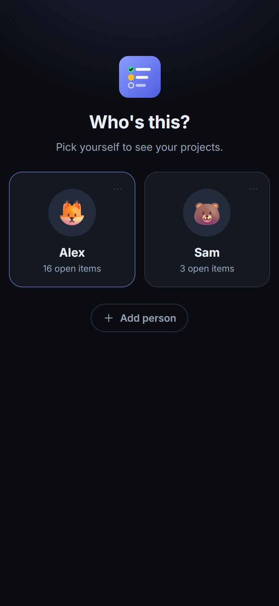
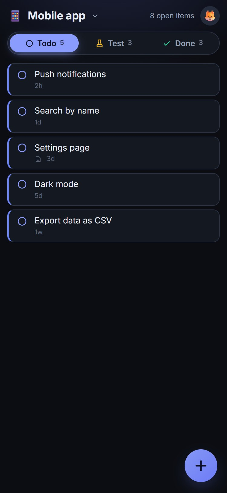
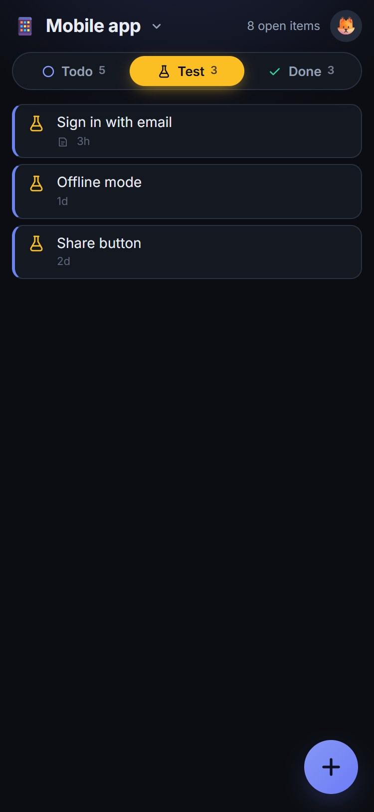
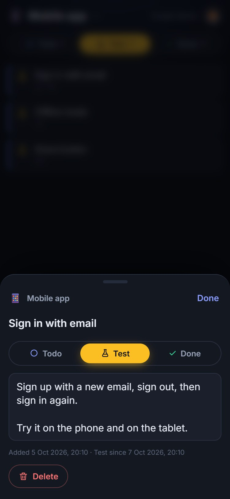
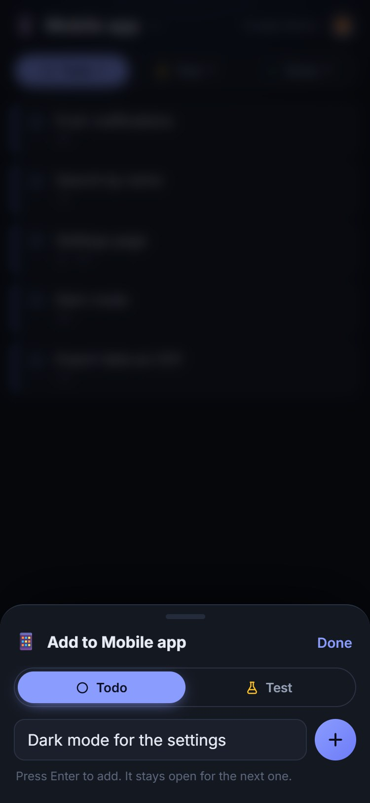
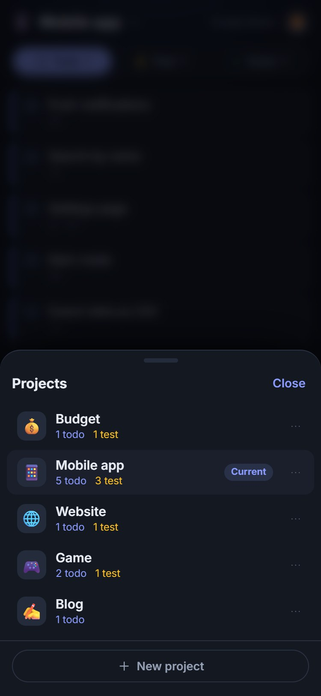
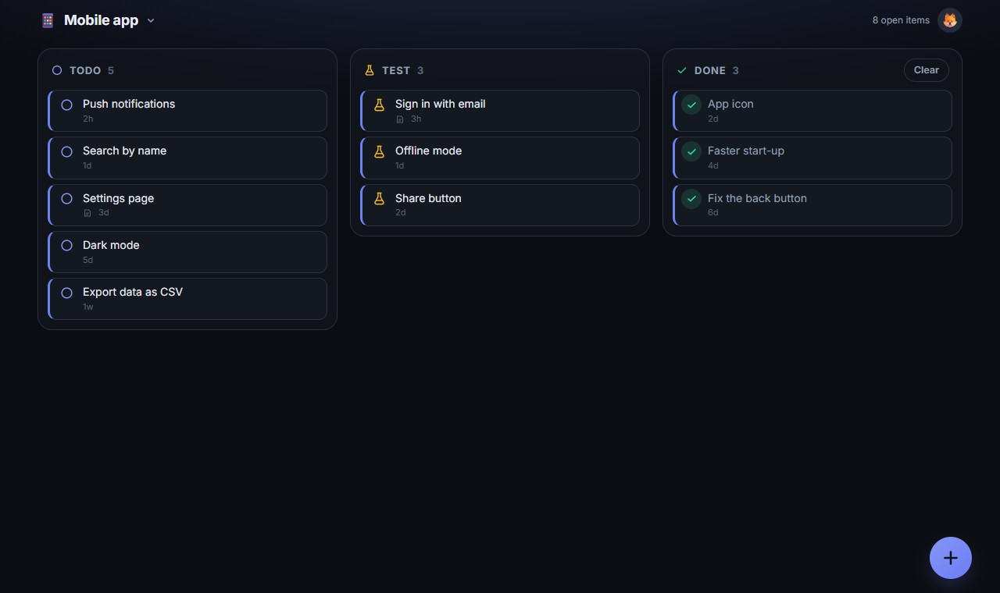

# Project Tracker

A to-do and ready-to-test tracker for every project you're working on, as a Home Assistant add-on.

Everyone in the house picks themselves on the home screen and has their own projects.
Add a project, tap **+** to jot down what's to do, and move each item along with one tap:
**Todo** → **Test** → **Done**. Made for phones, in portrait; on a PC the three lists sit side by side.

<p>
  
  
  
  
  
  
</p>
<p>
  
</p>

## Installation

Add this repository to Home Assistant:

1. Go to **Settings** → **Add-ons** → **Add-on Store**
2. Click menu (⋮) → **Repositories**
3. Add: `https://github.com/christina-thd/project-tracker`
4. Install **Project Tracker** from the store

## Add-ons

### Project Tracker

Keep track of what's to do and what's ready to test, per project.

**Features:**
- Everyone in the house has their own projects: pick yourself on the home screen
- A project per thing you work on, each with its own emoji
- Todo, Test and Done lists, with notes on any item
- Quick add: tap +, type, press Enter, and the next one
- Live on every screen: phone and PC at the same time

[Documentation →](./project-tracker/README.md)

## Development

The app is plain Node.js with no build step and no dependencies. See
[project-tracker/docs/DEVELOPMENT.md](./project-tracker/docs/DEVELOPMENT.md).

```sh
cd project-tracker
npm test
npm run dev
```

## Support

For issues, check the add-on logs or open an issue in this repository.
